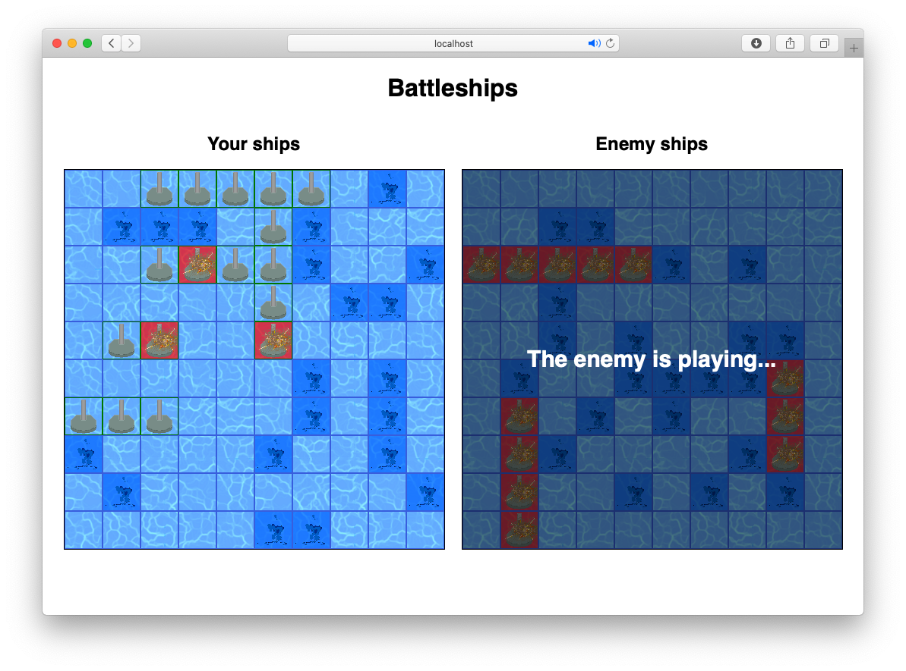

# JS-BattleShips
A simple recreation of the the classic game ‘Battleship’ within a Test Development Driven (TDD) environment. With animations and sounds.



## Live version
A live version of the game can be found [here](https://raw.githack.com/elshaka/JS-BattleShips/development/dist/index.html)

## Setting up

### Installing dependencies

```
npm install
```

### Starting the server

```
npm run start
```

If all goes well the game should be avalable at http://localhost:8080


### Running the test suites
```
npm run test
```


## Built With

- HTML, CSS
- [JavaScript](https://developer.mozilla.org/en-US/docs/Web/JavaScript)
- [Node Package Manager(NPM)](https://www.npmjs.com/)
- [Jest](https://github.com/facebook/jest)


## Authors

👤 **Aaron Rory**

- Github: [@Aaron-RN](https://github.com/Aaron-RN)
- Twitter: [@ARNewbold](https://twitter.com/ARNewbold)
- Linkedin: [Aaron Newbold](https://www.linkedin.com/in/aaron-newbold-1b9233187/)

👤 **Eleazar Meza Rivas**

- Github: [@elshaka](https://github.com/elshaka)
- Twitter: [@elshaka](https://twitter.com/elshaka)
- Linkedin: [Eleazar Meza Rivas](https://www.linkedin.com/in/elshaka/)

## 🤝 Contributing

Contributions, issues and feature requests are welcome!

Feel free to check the [issues page](issues/).

## Show your support

Give a ⭐️ if you like this project!

## 📝 License

This project is [MIT](lic.url) licensed.
